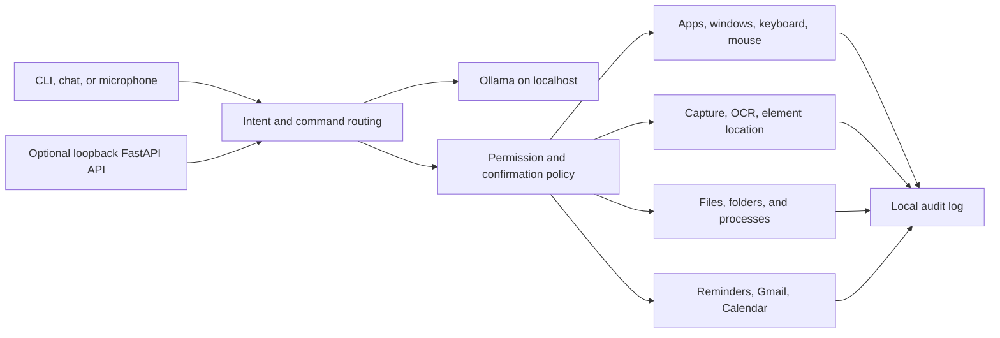

# Architecture Overview

Grandpa is a local-first Windows assistant. Voice and CLI input share one
intent-routing and safety path before any action reaches Windows.

## Runtime Boundaries

- Ollama is the only inference engine configured by the supported runtime.
- The CLI, voice assistant, and voice operator reuse typed local actions.
- Safety policy and explicit confirmation guard destructive or sensitive work.
- Screen text and model output are untrusted input, never authorization.
- FastAPI binds to loopback by default and does not serve a dashboard.
- Gmail and Calendar are optional OAuth integrations with credentials stored
  under the local Grandpa directory.
- Diagnostic telemetry, traces, and audit records stay on the local machine.

## Main Entrypoints

- `grandpa chat`: interactive assistant
- `grandpa voice`: local speech input
- `grandpa voice-operator`: action-oriented voice loop
- `grandpa automation`: desktop automation commands
- `grandpa screen`: screen awareness and OCR
- `grandpa reminders`: local reminders
- `grandpa serve`: optional trusted loopback API

See [Domain Boundaries](domain-architecture.md) for package ownership and
[Security](security.md) for the action policy.
