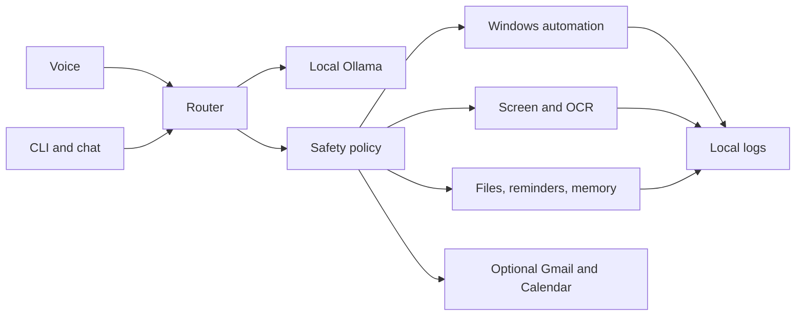

# Repository Structure

```text
Grandpa/
  .github/      Focused CI, issue templates, and release automation
  configs/      Local Ollama and assistant configuration examples
  docs/         User, architecture, testing, and development documentation
  examples/     Small local assistant usage examples
  models/       Ollama Modelfile recipes; no downloaded weights
  rust/         Optional native acceleration and compatibility workspace
  scripts/      Installation, validation, release, and maintenance utilities
  src/grandpa/  Python application and runtime domains
  tests/        Local regression and safety tests
```

## Runtime Map



## Ownership

- `cli`, `voice`, and `speech` own user interaction.
- `engine` owns local inference.
- `automation`, `desktop`, `screen`, `files`, and `browser` own typed actions.
- `safety` and `security` own policy and audit.
- `memory`, `sessions`, `scheduler`, and `reminders` own local state.
- `server` exposes only the optional loopback API.
- `gmail` and `calendar` are optional personal integrations, not channels.

Generated artifacts such as `.uv-cache`, `dist`, `site`, `target`,
`__pycache__`, and test caches are documented in
[Local Artifacts](local-artifacts.md) and must not be committed.
