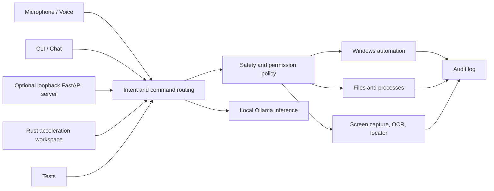

# Repository Structure

Grandpa is a Python-centered local Windows assistant. The CLI, voice runtime,
automation, screen understanding, safety policies, and optional local API all
share the `src/grandpa` package.

## High-Level Map

```text
Grandpa/
  .github/      CI, release, documentation, and issue automation
  configs/      Example local runtime configurations
  deploy/       Docker and service deployment assets
  docs/         Project documentation
  examples/     Safe usage and integration examples
  models/       Ollama Modelfile recipes; no model weights
  rust/         Native acceleration workspace
  scripts/      Install, validation, release, and maintenance utilities
  src/grandpa/  Python runtime
  tests/        Python regression suite
  tools/        Supporting development tools
```

## Runtime Architecture



## Important Boundaries

- `src/grandpa/cli/` owns terminal entrypoints and interactive sessions.
- `src/grandpa/voice/` and `src/grandpa/speech/` own local audio behavior.
- `src/grandpa/automation/`, `src/grandpa/desktop/`, and Windows control modules
  own typed, permission-aware actions.
- Screen modules may observe the visible desktop but must not bypass Windows
  protected surfaces.
- `src/grandpa/security/` and policy modules remain authoritative for risky
  actions.
- `src/grandpa/server/` is an optional local API, not a bundled user interface.
- `rust/` remains because native acceleration is independent of user-interface
  packaging.
