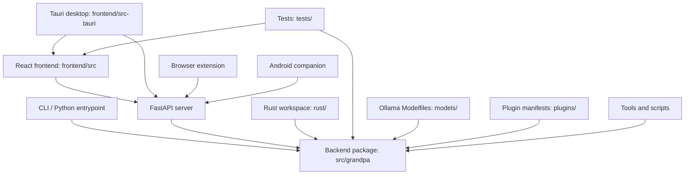

# Repository Structure

Grandpa is a multi-surface assistant repository. The Python package is the
runtime center, with desktop, browser, mobile, Rust, documentation, and
deployment assets arranged around it.

## High-Level Folder Map

```text
Grandpa/
  .github/              GitHub workflows, templates, and repository automation
  browser-extension/    Browser companion extension
  configs/              Example and default Grandpa configuration
  deploy/               Deployment assets for services and infrastructure
  docs/                 MkDocs documentation source
  examples/             Example integrations and workflows
  frontend/             React frontend and Tauri desktop shell
  mobile/               Android companion application
  models/               Ollama Modelfile recipes
  plugins/              Built-in and user plugin manifests
  rust/                 Rust workspace for Grandpa core crates
  scripts/              Developer, install, test, and release utilities
  src/                  Python source package
  tests/                Python test suite
  tools/                Supporting external or reference tools
```

## Top-Level Folder Purposes

| Path | Purpose |
| --- | --- |
| `.github/` | CI, release, desktop, docs, clone-stat, and issue-template automation. |
| `browser-extension/` | Manifest V3 extension that connects browser context to the local Grandpa backend. |
| `configs/` | Example configuration and persona files for local Grandpa runtime behavior. |
| `deploy/` | Docker, service manager, and hosted-service deployment support. |
| `docs/` | MkDocs documentation, architecture notes, user guides, generated API reference source, and development docs. |
| `examples/` | Standalone examples for bots, research, routing, scheduled operations, and other integrations. |
| `frontend/` | React/Vite frontend plus the Tauri desktop application under `frontend/src-tauri/`. |
| `mobile/` | Flutter Android companion app and Android project files. |
| `models/` | Ollama Modelfile recipes only; model weights are not stored in the repository. |
| `plugins/` | Built-in and user plugin manifest locations used by the plugin system. |
| `rust/` | Rust workspace containing Grandpa core crates separate from the Tauri desktop shell. |
| `scripts/` | Utility scripts for development, installation, testing, release, and local operations. |
| `src/` | Python package root. The importable package is `src/grandpa/`. |
| `tests/` | Central pytest suite for Python runtime, server, automation, voice, agents, tools, and related systems. |
| `tools/` | Supporting reference tools that are not part of the main Python package. |

## Architecture Diagram



## Notes for Future Reorganization

- Keep `src/grandpa/` stable unless a dedicated package migration updates
  imports, build metadata, tests, and documentation together.
- Keep `frontend/` and `frontend/src-tauri/` stable because Tauri, Vite, and
  GitHub Actions reference those paths directly.
- Keep `rust/` stable because CI and Rust workspace metadata rely on it.
- Treat browser extension and mobile project moves as separate migrations.
