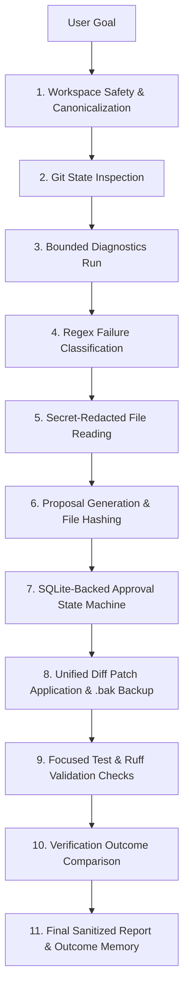

# Grandpa Agent Execution V2 User Guide

The **Grandpa Agent Execution Engine V2** implements a safe, structured, and bounded developer-assistant execution environment that diagnoses code, tests, or styling errors, proposes minimal patches, prompts for explicit user approval, applies patches transactionally, and runs post-fix validations.

---

## Architecture

The V2 engine enforces security and correctness across multiple distinct stages:



---

## CLI Command Reference

### Workspace Inspection
Analyze repository state, canonicalize paths, and verify clean tree:
```bash
grandpa agent inspect "Check project state"
```

### Failure Diagnosis
Run diagnostics suite, parse error stack trace, locate failing lines, draft a minimal patch, and queue it:
```bash
grandpa agent diagnose "Fix the failing test tests/test_dummy.py"
```

### Patch Management
Preview, inspect, approve, or reject generated patches:
```bash
# Preview all pending patch proposals
grandpa agent patch preview

# Show full details of a specific proposal
grandpa agent patch show <proposal-id>

# Approve a patch proposal
grandpa agent patch approve <proposal-id>

# Reject a patch proposal
grandpa agent patch reject <proposal-id>
```

### Patch Application
Apply approved patch, create file backups (`.bak`), and run post-write lint/pytest checks:
```bash
grandpa agent patch apply <proposal-id>
```

### Status & Reports
Check validation outcome and execution summary:
```bash
# View lint, compile, and diff check statuses
grandpa agent validate

# View last verification outcome
grandpa agent report
```

### Bounded Transaction Rollback
Roll back changes by restoring file snapshot backups (`.bak`) created before execution:
```bash
grandpa agent rollback <execution-id>
```

---

## Core Safety Constraints

1. **Path Isolation**: Workspace paths are limited strictly to the canonical project root (`D:\Grandpa`) and system temp directories. Paths containing sensitive locations (like `.ssh`, `.aws`, `.gemini`, `AppData`) are rejected immediately.
2. **Command Allowlist**: Execution is restricted to defined lints and pytest targets:
   - `python -m compileall -q src tests scripts`
   - `uv run ruff check src tests`
   - `uv run pytest <approved paths>`
   - `git diff --check`
   - `git status --short`
3. **No Automated Edits**: All write operations require manual approval via `grandpa agent patch approve`.
4. **No Git Commit/Push**: Auto-committing, push operations, or branching are strictly prohibited.
