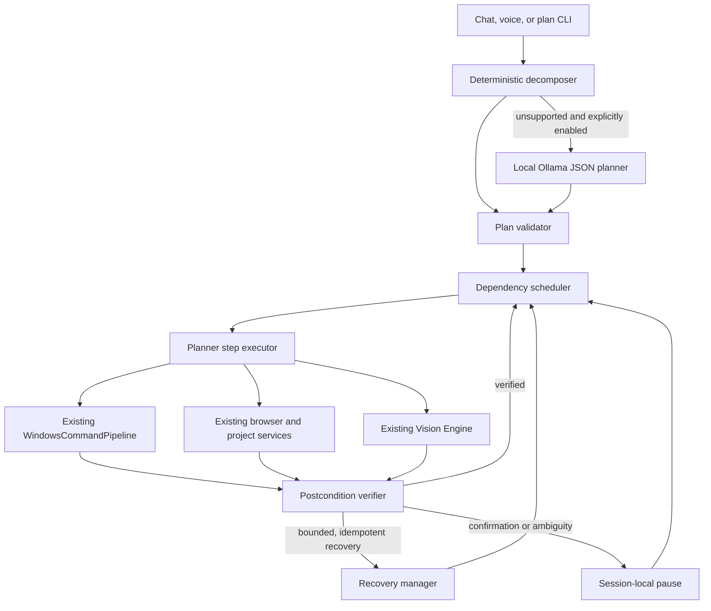

# Executive Planner

Grandpa Executive Planner V1 converts supported natural-language goals into bounded,
inspectable execution plans. It orchestrates existing local automation services; it
does not provide arbitrary code or shell execution.

## Architecture



The planner reuses the existing confirmation tokens, pinned window targets, dialog
state, Vision element graph, application resolver, project manager, and browser
automation. It never invokes a raw coordinate, executable path, shell command,
PowerShell command, or Python snippet supplied by a model.

## Decomposition

Deterministic patterns are tried first. V1 recognizes bounded workflows including:

- open an application and perform a browser search;
- open Notepad, type literal text, and close through its verified dialog;
- open Settings and navigate to a named visible control;
- open a project in VS Code;
- open Calculator and enter a validated arithmetic expression;
- find and click a verified element; and
- scroll a bounded number of times until a named element appears.

Text supplied to `type_text` and search actions remains literal. Words such as
`delete`, `close`, or `shutdown` inside that text are not reparsed as actions.

Use `--local-model` to permit the optional Ollama fallback. The fallback receives
only the goal, public action schema, safety instructions, and step limit. It must
return strict JSON. Every returned step is validated before execution. Missing
Ollama, malformed JSON, unknown actions, unexpected parameters, and invalid
verification strategies fail closed.

## Action Catalogue

The initial allowlist covers application/window lifecycle, keyboard input, verified
element lookup and interaction, bounded scrolling and waits, browser navigation and
search, approved file/folder opens, verified document saves and dialogs, visible
screen reading, speech, confirmation, and clarification.

Each action defines its accepted parameters, risk, permitted verification methods,
confirmation behavior, recovery behavior, Vision dependency, and literal fields.
Adding a Python handler without adding and validating its catalogue definition does
not make it executable.

## Lifecycle

Plans move through `created`, `validating`, `ready`, `running`, pause states,
`recovering`, and a terminal state. Steps separately track pending, ready, running,
verifying, retrying, pause, and terminal states. Limits bound steps, attempts,
recoveries, replans, scrolling, and total execution time.

State is keyed by session and sanitized snapshots are stored under
`~/.grandpa/plans`. Confirmation and ambiguity responses are accepted only by the
owning planner session. User output and dumps redact sensitive values and do not
show HWND, PID, runtime identity, or confirmation tokens.

## Verification And Recovery

Sending input is not proof of success. Mutating actions declare a mandatory semantic
postcondition such as an existing/focused application window, visible element,
verified dialog state, closed document, observed text, URL, or file state. Screen
change checks use the structured Vision graph and are not sufficient evidence for
destructive or sensitive operations.

Recovery is bounded and limited to safe idempotent operations such as refocusing the
pinned window, refreshing the Vision graph, or waiting once. Clicks, typing, saves,
dialog actions, browser submissions, and other potentially non-idempotent actions
are never retried automatically.

## Confirmation And Clarification

The plan pauses at a confirmation boundary and resumes the same step only after an
answer from its owning session. A rejected confirmation cancels the plan safely.
Ambiguous windows or elements retain numbered choices in internal state; follow-ups
such as `choose first` are delegated to the existing verified automation ambiguity
handler. The original action is not replayed.

## CLI

```powershell
grandpa plan create "Open Chrome and search for FastAPI"
grandpa plan preview "Open Chrome and search for FastAPI"
grandpa plan execute "Open Chrome and search for FastAPI"
grandpa plan execute --dry-run "Open Calculator and calculate 145 multiplied by 89"
grandpa plan status
grandpa plan show
grandpa plan pause
grandpa plan resume
grandpa plan resume --yes
grandpa plan clarify "choose first"
grandpa plan cancel
grandpa plan retry
grandpa plan list
grandpa plan dump
grandpa plan trace
grandpa plan graph --mermaid
```

`create`, `preview`, `show`, `status`, `list`, `dump`, `trace`, and `graph` never
execute automation. Dumps are restricted to Grandpa's plan export directory.

## Safe Examples

- `Open Chrome and search for FastAPI documentation.`
- `Open Calculator and calculate 145 multiplied by 89.`
- `Open Settings and navigate to Bluetooth.`
- `Open Notepad, type Grandpa planner test, then close without saving.`

Preview plans before running them when testing. Do not use this milestone for
purchases, messages, destructive file operations, credentials, or system changes.

## Known Limitations

- V1 executes synchronously and checks cancellation between bounded steps; it does
  not run a background autonomous agent.
- Deterministic language coverage is intentionally narrow.
- Local-model planning is opt-in and does not replan automatically.
- Verification depends on the capabilities exposed by the existing Windows,
  browser, project, and Vision services.
- OCR-only elements remain read-only unless an existing trusted provider
  corroborates an actionable target.

## Developer Extension Guide

1. Add an `ActionDefinition` with the narrowest possible parameter schema.
2. Add deterministic decomposition where the language is unambiguous.
3. Bridge the action only to an existing trusted service in `executor.py`.
4. Add a semantic postcondition in `verifier.py`.
5. Classify confirmation and non-idempotent retry behavior explicitly.
6. Add rejection, verification-failure, confirmation, and session-isolation tests.

Future work may add richer deterministic grammar, verified remaining-step replans,
more semantic browser state, and asynchronous cancellation without introducing an
always-running agent.
